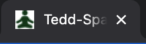

# **Tedd-Space Wellbeing Garden Website**

## **Site Goals**

<br>

The Tedd-Space website has been designed to provide visitors with the opportunity to gather information about a fictional community wellbeing garden based in Teddington, TW11.  The goal of the site owner is to create an online presence to give greater exposure to the garden and increase the user base within the TW11 community. There is a particular emphasis on the positive impact of horticulture and nature on our wellbeing and mental health.

Site users can learn about the ethos and vision of the garden, gain better understanding of the links between nature and wellbeing, gather information about how the garden engages the local community, and easily find the details they need to visit.   They can also learn about volunteering opportunities and register their interest in getting involved.

<br>


___

# **CONTENTS**

* [User Experience (UX)](#user-experience-(ux))
    * [Strategy](#strategy)
        * [User Stories](#user-stories)
    * [Scope](#scope)
    * [Structure](#structure)
        * [Common Features](#common-features)
        * [About Page](#about-page)
        * [Wellbeing Page](#wellbeing-page)
        * [Community Page](#community-page)
        * [Visit Page](#visit-page)
        * [Volunteer Page](#volunteer-page)
        * [Thankyou Page](#thankyou-page)
        * [Meta Tags for social media display](#meta-tags-for-social-media-display)
    * [Skeleton](#skeleton)
        * [Wireframes](#wireframes)
    * [Surface](#surface)
        * [Colour Palette](#colour-palette)
        * [Contrast](#contrast)
        * [Typography](#typography)
        * [Imagery](#imagery)
        * [Accessibility](#accessibility)
* [Technologies Used](#technologies-used)
    * [Languages Used](#languages-used)
    * [Frameworks, Libraries & Programs Used](#frameworks-libraries-and-programs-used)
* [Deployment & Local Development](#deployment-and-local-development)
    * [How to Fork](#how-to-fork)
    * [How to Clone](#how-to-clone)
* [Testing](#testing)
    * [Automated Testing](#automated-testing)
        * [W3c Validator](#w3c-validator)
        * [Lighthouse](#lighthouse)
        * [WAVE](#wave)
    * [Manual Testing](#manual-testing)
        * [Testing User Stories](#testing-user-stories)
        * [Full Testing](#full-testing)
* [Bugs](#bugs)
    * [Known Bugs](#known-bugs)
    * [Solved Bugs](#solved-bugs)
* [Credits](#credits)
    * [Code Used](#code-used)
    * [Content](#content)
    * [Media](#media)
    * [Acknowledgements](#acknowledgements)

# **User Experience (UX)**

## **STRATEGY**
___

### **Why build this site?**
<br>
The wellbeing garden was completed in April 2022. Market research carried out by Richmond Council within the local community has highlighted that many residents of TW11 do not know about the garden. So a core goal of the website will be to increase exposure in the hope of attracting a new diverse user base.

<br>

Research has highlighted the toll that the pandemic had on wellbeing and mental health.  So another core goal of the website will be to emphasise how the benefits of the garden can be two fold. Time spent outside engaging with nature along with the opportunity to reduce isolation by connecting with the community.

<br>

### **What is needed?**

<br>

The website will be an online resource where users will go to understand more about the garden, how they can visit and how it could improve their lives.

<br>

___

## **User Stories**
<br>

### Client Goals:

<br>

* As the client, I want to boost the profile of the garden by creating an online presence.
* As the client, I want to increase accessibility of the garden by promoting the location and opening hours.
* As the client, I want to encourage positive mental health in the community by promoting the benefits of the garden for emotional wellbeing.
* As the client, I want to make users aware of how the garden can help them connect with the community through a range of organised events/ classes/ activities.
* As the client, I want to increase the number of active volunteers
* As the client, I want to make sure the site can be viwed on a range of different sized devices

<br>

### First Time Visitor Goals:

<br>

* As a first time user, I want to know more about the garden and it’s vision for the community.
* As a first time visitor, I want to know how the garden could have a positive impact on my wellbeing, so I can decide whether I could use it.
* As a first time visitor, I want to view address details and opening hours, so that I know where to visit and when.
* As a first time visitor, I want to be able to find out more about volunteering, so I can decide whether this could be for me.
* As a first time visitor, I want to learn more about the activities that run in partnership with the garden, to decide whether these would be of any interest to me.

<br>

### Return Visitor Goals:

<br>

* As a return visitor, I want to make contact to offer my time as a volunteer, so I can feel connected with the community.
* As a return visitor, I want to learn **more** about how horticulture and being surrounded by nature can improve our mental health.

<br>

### Repeat Visitor Goals:

<br>

* As a repeat visitor, I want to be kept up to date with Tedd-Space news, updates and future events, so I can stay informed and feel connected.

<br>

## **SCOPE**
___

<br>

| Opportunity/ Problem                                       | Importance | Viability/ Feasibility |
| :--------------------------------------------------------- | :--------: | :--------------------: |                         
| Create online presence to increase awareness of the garden | 5          | 5                      |
| Promote benefits of gardens for wellbeing                  | 4          | 5                      |      
| Provide news/updates about garden.Promote upcoming events  | 3          | 1                      | 
| Encourage volunteers to get involved                       | 4          | 4                      |
| Promote community aspect of the garden                     | 3          | 4                      |
| Start a blog. Horticulture/ Wellbeing etc                  | 2          | 1                      |


<br>


### **Features To Be Included:**

<br>

* An About section that makes the user aware of what the garden is and its primary goals and objectives.

* A Wellbeing section that explains some of the design features used in the garden to promote positive mental health.

* A Community section where the user can learn ways in which the garden can be used to stay active, interact with others and educate future generations.

* A Visit section where users can obtain the information they need to visit the garden - address details, opening hours.

* A Volunteer section where users can find out more about the volunteers that help run the garden.  If interested there is an opportunity for the user to make contact via a form.

<br>

### **Future Implementations:**

<br>

* Addition of a news, updates and upcoming events section.  For now this information can be accessed externally by clicking social media links, but it would nice to eventually integrate a live feed into the site.

* Addition of a blog page with varied topics covered.  This would give the user the chance to find out more detailed information about the core goals of the site owner, for example in depth features and articles about how gardens and horticulture can improve our physical and mental wellbeing.  This would be a neater solution than simply adding links for articles on external sites.

<br>

## **STRUCTURE**

___

<br>

### **Common Features**

<br>

* A favicon is displayed in each browser tab.  The image is a squared off version of the logo used in the header. It is a 16px X 16px ico file generated on the [Favicon.ico & App Icon Generator](https://www.favicon-generator.org/) 



* The header will feature at the top of each page with the site name and logo to the left and a responsive navigation bar will be positioned to the right.  This header will remain fixed as you scroll down the page, always allowing the user to easily jump to the section they are interested in.  Clicking on the Tedd-Space name and logo wil always take the user back to the about page.  Clicking on the navigation links will jump the user to the relevant section. Following the principles of information architecture,  as these links are all closely tied to the core user needs and owner objectives they are positioned at the highest level of the site.  Hovering over any of the navigation menu links transforms the font size to 120% and the cursor changes to a hand pointer, indicating that clicking will take the user to a new page, therefore making the experience intuitive.  The current page link in the menu shows as bold to always inform the user where they are within the site.   


* To ensure a good user experience in all situations, a media query is used to prevent the naviagtion bar looking squashed and cluttered on mobile devices with smaller screen sizes.  The navigation bar is replaced with a burger menu toggler at 950px and under.  For screens at 450px and under, a further media query is used to reduce the overall size of these header items to give everything space.  When the burger icon is selected, the header expands vertically with the navigation menu displayed. I have chosen this method of using the burger icon as it follows convention and is immediately recognisable.  It therefore aligns with user expectation, providing them with an intuitive experience as they navigate the sight.  A recognisable cross icon is used to indicate to the user that clicking will close the menu.


* The footer will feature at the bottom of each page, with social media links to the Tedd-Space Facebook, Twitter and Instagram pages opening in new browser tabs when clicked.  Font awesome icons are used as they are universally recognisable for the user without the need for text.  A hover effect which transforms the icon size to 110% and changes the colour to a lighter green indicates to the user that these links are clickable.  A secondary navigation menu is positioned in the centre of the footer, incase the user is ever at the bottom of the page and wants to naviage to a new location.  A hover effect increasing the font size to 120% indicates that these links are clickable. To ensure that the Tedd-Space brand is visible throughout, the name appears on the left of the footer and clicking on this will always direct the user back to the home page.


<br>

### **About Page**

<br>

* The aim of the owner is that the purpose of the site should be immediately evident to the user when they land on the home page.  This is achieved by using a hero image of a close up leaf that instantly indicates to the user that the site relates to nature and the dark green colour aims to achieve an emotional response of calmness.  The user is then provided with two core pieces of information as the hero text fades in, to make clear that Tedd-Space is a wellbeing garden and it is located in the TW11 postcode.


* The user is then provided with a concise welcome section where they can understand exactly what Tedd-Space is and what it aims to achieve. This is accompanied by an image which hopes to envoke a positive emotional response ( "this is somewhere I would like to spend time" ) and draws them to learning more about the wellbeing garden.

* The core goals of Tedd-Space are laid out next, to demonstrate to the user 3 different ways the garden could benefit them.  Icons are used above each goal as hints, so the user understands the core aims of Tedd-Space before they have even read the etxt.  Under each goal, an explore button makes it intuitive for the user to learn more about each topic without even having to use the top navigation menu.  This is an example of using progressive disclosure, to engage the user and gradually present them with more content as they navigate the website.  For consistency of user experience, the explore buttons feature the same transform effect on hovering as experienced in the header and footer.

<br>


### **Wellbeing Page**

<br>

* This page provides the user with further information about how the Tedd-Space garden can improve wellbeing.  To ensure consitency of user experience, the page layout is similar in format to the about page. There is a concise intro, a calm image to convey the theme of wellbeing and then 3 design features to look out for.

<br>


### **Community Page**

<br>

* This provides the user with information about the community aspect of Tedd-Space.  The timetable of activities is prominent and features the same background leaf image used on the landing page.  The follow us button makes it easy for the user to find social media links, and there is a link to direct them back  to the timetable if they have scrolled past this but then want to find out more.  

* The slide show provides the user with an opportunity to interact with the site and build an understanding of how the garden could be used.

* Descriptions of 3 different types of community engagement are detailed in the familiar 3 column layout (collapses to single column on mobile devices below 950px).  Font awesome icons ensure that there is continuity and familiarity between pages.

<br>


### **Visit Page**

<br>

* Now that the user has been presented with information about the garden and it's benefits, it is important to provide them with the information needed to visit.  An interactive embedded Google Map shows location and if zoomed out, can give the user context about surrounding areas.  Also core information with full address and opening hours, makes the opportunity to use the garden as simple as possible.  The site owner hopes that this will result in an increase in the user base.

<br>


### **Volunteer Page**

<br>

* Users are presented with some information about the volunteering opportunities.  They will also have the opportunity to interact with a form by submitting their name, email address, using a drop down menu to signal their availability and a text field for any further details.  A send button with familiar consistent hover effect allows users to submit this information.  Feedback will be give to the user throughout the form interaction, with each input field highlighted when in focus and tooltip alerts if a required field has not been filled in correctly.

<br>


### **Thankyou Page**

* Once the form has been submitted successfully, feedback will given to the user by directing them to a thankyou page.  Here they will be thanked for their interest and told that someone from Tedd-Space will be in touch as soon as possible.  The keep exploring button allows users to be guided back to the website home page. 

<br>


<br>

### **Meta Tags for social media display**

<br>

Open Graph and Twitter meta tags have ben used in the head of each page to control how the URL is displayed when shared on social media.  They make content more eye catching in social media feeds, tell people what the content is at a glance and can also increase your brand visibiity through searches.  I learnt about them through this [article](https://ahrefs.com/blog/open-graph-meta-tags/).  Below is an image of how the site is displayed on social media feeds:


## **SKELETON**

___

<br>

### **Wireframes**

<br>

Wireframes for desktop, tablet and mobile:

* [Index Wireframe](docs/wireframes/index.png)
* [Wellbeing Wireframe](docs/wireframes/Wellbeing.png)
* [Community Wireframe](docs/wireframes/Community.png)
* [Visit Wireframe](docs/wireframes/Visit.png)
* [Volunteer Wireframe](docs/wireframes/Volunteer.png)

<br>

## **SURFACE**

___

<br>

## **Colour Palette**

<br>

The website aims to use a calming colour palette to align with the Tedd-Space ethos of promoting calm minds.  The user should get the same sense of calmness and wellbeing when navigating the site as they would when visiting the garden.  Green is known to be a soothing colour and also gives the user a sense of being surrounded by nature.  The palette is limited to keep the site looking clean, simple and spacious.  Colours from the [close up leaf](docs/leaf-hero-ref.webp) hero image were extracted using the generator tool on the [coolors](https://coolors.co/) website.  This is the basis for the dark green text that is used consistently throughout the site and the occassional lighter green that is used to give user feedback when hovering over buttons.  The white smoke colour is used against a pure white backdrop to structure the website in a simple clean way, highlighting columns,text boxes and the footer. 

<br>


<br>

## **Contrast**

<br>

The simple colour palette means that there is good contrast between the background and text.  I used the WebAim [contrast checker](https://webaim.org/resources/contrastchecker/) to investigate contrasts.

<br>


<br>

To ensure that the contrast between the hero background image and hero text was optimal, I applied a linear gradient on the image as a CSS rule to make it darker and help the white text stand out more.

<br>

## **Typography**

<br>

Spacing and typography will remain consistent throughout the site to give the user a sense of familiarity wherever they navigate to another page.  Icons will be used alongside informational headings to hint at content.  The following fonts have been selected from Google Fonts:

* Headings:  Montserrat.  This is a sans-serif font.
* Body:  Source Sans Pro.  This is a sans-serif font.
* Hero text and Summer Timetable:  Amatic SC.  This is a cursive font.

Inspiration for the font combination came from this [article](https://www.thedenizenco.com/journal/clean-minimal-font-pairings) about clean minimal font pairings. 

<br>

## **Imagery**

<br>

Imagery throughout aims to tie in with the goals of the site, for example images of the garden should provide a feeling of calm. Images focusing on the social commmunity aspect should be friendly and welcoming.  The logo used in the header has been chosen for it's simplicity yet it is still able to covey a message to the user - "this is a site that focuses on improving your wellbeing".

## **Accessibility**

___

<br>

To enusure that the website is as accessible as possible for all users and compatible with screen readers, I have done the following:

* Semantic markup has been used to structure the HTML code.
* Check that the colour contrast ratio across the website meets acceptable standards.
* Descriptive alt attributes have been given to all images.
* Aria labels have been used for interactive elements where no accessible name is provided. For example the hamburger menu icon I have used for smaller screen sizes or the social media links in the footer.
* The aria hidden attribute has been added to icons that are purely decorative. 


# **Technologies Used**

<br>

## **Languages Used**

<br>

HTML and CSS were used to create the website.

<br>

## **Frameworks, Libraries & Programs Used**

<br>

* Git -  Version control.
* GitHub - All files for the website stored and saved in a repository.
* GitHub Pages - Used to deploy the final version of the website.
* Balsamiq - Used to create wireframes.
* Font Awesome - Used for all icons throughout the website.
* Google Fonts - Used to import required fonts for the website via the css style page.
* Google Developer Tools - Used throughout build of website for debugging and trialing new features/ styling.
* Google Lighthouse - Used at testing stage to show statistics for performance, accessibility,  best practices and SEO.
* TinyPNG - For compression of image files to improve website performance.
* Birme - For resizing and reformatting images to make them suitable for use on the website.
* Am I Responsive? - For displaying images of how the website looks across a range of devices.

<br>

# **Deployment & Local Development**

<br> 

## **Deployment**

<br>

The live website has been deployed using GitHub Pages, following the steps below:

1. Log in (or sign up) to GitHub.
2. Click on the required repository, in this case: rkillickdev/tedd-space-wellbeing-garden
3. Go to the "Settings" menu.
4. Select the "Pages" tab in the left hand menu - this will jump you to a section called "GitHub Pages".
5. Under the Build and deployment section, select "main" from the select branch menu.  Select "root" from the dropdown select folder menu.
6. Click save.  The URL for your live site which has been deployed on GitHub pages is shown at the top of the GitHub pages section.  This sometimes does not display immediately or may require a browser refresh.

<br>

## **Local Development**

<br>

### **How to fork:**

<br>

1. Login to GitHub.
2. Find the required repository, in this case: rkillickdev/tedd-space-wellbeing-garden
3. Click on the "fork" button at the top right of the page.

<br>

### **How to clone**

<br>

# **Testing**

<br>

## **Automated Testing**

### **W3c Validator**

I used the [W3C](https://validator.w3.org/) Markup Validation Service to validate the HTML on all pages of the website.

| Page | Result |
| ---- | -------|
| [Index.html](docs/testing/w3c/w3c-html-validated-index.png) | Passed |
| [wellbeing.html](docs/testing/w3c/w3c-html-validated-wellbeing.png) | Passed |
| [community.html](docs/testing/w3c/w3c-html-validated-community.png) | Passed |
| [visit.html](docs/testing/w3c/w3c-html-validated-visit.png) | Passed |
| [volunteer.html](docs/testing/w3c/w3c-html-validated-volunteer.png) | Passed |
| [thankyou.html](docs/testing/w3c/w3c-html-validated-thankyou.png) | Passed |

I used the [W3C jigsaw](https://jigsaw.w3.org/css-validator/) CSS Validation Service to validate my CSS stylesheet.

| Page | Result |
| ---- | -------|
| [style.css](docs/testing/w3c/w3c-jigsaw-css-validated.png) | Passed |

<br>

### **Lighthouse**

I used Lighthouse within Google Chrome developer tools as a way of testing performance, accessibility, best practices and SEO across all pages of the website.  I made the following tweaks during testing to achieve the final scores:

* Compressed and resized images to improve performance
* Saved some images as WebP format to improve performance
* Added more space between footer navigation menu links as this was originally bringing down my mobile accessibility scores.
* Added aria labels to slideshow navigation controls to improve accessibility score

### **Desktop Results**

<br>


<br>

### **Mobile Results**

<br>


### **WAVE**

I have used the [WAVE](https://wave.webaim.org/) tool to evaluate the web accessibility of each page on the site:

| Page | Result |
| ---- | -------|
| [Index accessibility evaluation](docs/testing/accessibility/wave-accessibility-index.png) | Passed |
| [Wellbeing accessibility evaluation](docs/testing/accessibility/wave-accessibility-wellbeing.png) | Passed |
| [Community accessibility evaluation](docs/testing/accessibility/wave-accessibility-community.png) | Passed |
| [Visit accessibility evaluation](docs/testing/accessibility/wave-accessibility-visit.png) | Passed |
| [Volunteer accessibility evaluation](docs/testing/accessibility/wave-accessibility-volunteer.png) | Passed |
| [Thankyou accessibility evaluation](docs/testing/accessibility/wave-accessibility-thankyou.png) | Passed |

## **Manual Testing**

### **Testing User Stories**

<br>

| Goals | How are goals achieved? |
| --- | --- | 
| Client |    
|        |                                                                                                                                
| I want to boost the profile of the garden by creating an online presence. | Creation of the website has provided an online presence for Tedd-Space and given a platform to promote the wellbeing garden. |
| I want to increase accessibility of the garden by promoting the location and opening hours. | A "visit" link in the top menu provides one click easy access to all the information a user needs to visit the garden. |
| I want to encourage positive mental health in the community by promoting the benefits of the garden for emotional wellbeing. | The 'Minds Matter' information on the home page introduces the user to the link between spending time surrounded by nature and better mental health. The ability to learn more about this topic is made easy and intuitive for the user by including an 'explore' button that takes them directly to the Wellbeing page. |  
| I want to make users aware of how the garden can help them connect with the community through a range of organised events/ classes and activities. | The 'Community' text box on the home page gives the user an introduction into how they can use Tedd-Space to connect with their community.  The ability to learn more about this topic is made easy and intuitive for the user by including an 'explore' button that takes them directly to the Community page. |    
| I want to increase the number of active volunteers. | The "Belong" text box on the home page helps introduce the user to the concept of volunteering.  The ability to learn more about this topic is made easy and intuitive for the user by including an 'explore' button that takes them directly to the Volunteer page.  A form is easily accessible and easy to use if the user chooses to make contact about offering their time as a volunteer. |                            
| I want to make sure the site can be viewed on a range of different sized devices. | Media queries have been used to ensure that site content looks appealing and is intuitive to use on dektop, tablet and smaller mobile devices. |
|        |                                                                    
| First Time Visitors |                                                         
|        |                                                                  
| I want to know more about the garden and it’s vision for the community. | The "Take a breath" text box on the home page gives a brief introduction where the user can understand the core ethos of the wellbeing garden.  The 3 concepts of "Minds Matter", "Community" and "Belong" expand on these ideas and offers the user a chance to explore more. |   
| I want to know how the garden could have a positive impact on my wellbeing. | Users can either be guided to the wellbeing page via an "explore" button having read the home page content, or get there directly from the navigation menu. | 
 I want to view address details and opening hours. | Details required to visit Tedd-Space are accessed easily via the "visit" menu link. As this is a core goal for the client, the link exists at the highest level of the site information architecture structure.  One click and the user can gather the information they need to visit. |                             
| I want to learn more about the activities that run in partnership with the garden. | The "Community" text box on the home page encourages the user to explore the community page.  Once they arrive, they can intuitively get a sense of the activities on offer, either by interacting with the image slideshow, reading the informational text boxes or using the timetable.  Users are also directed to social media channels to get more detailed and live information. |
| I want to be able to find out more about volunteering. |  The benefits of volunteering are introduced to the user in the "Belong" text box on the homepage, encouraging them to explore further and navigate to the volunteer page.  This can also be accessed directly via the navigation menu if the user has come to the site with this goal as their sole focus. |                      
|       |                                                         
| Return Visitors |                                                             
|       |                                                                      
| I want to make contact to offer my time as a volunteer. | Return users can head straight to the volunteer page via the navigation menu and use the form to submit their details. |                    
| I want to learn **more** about how horticulture and being surrounded by nature can improve our mental health. | Return users can head straight to the Wellbeing page to do this.  Future implementations such as a blog or specially curated articles for the site will make this goal more achievable, as they will provide greater depth of information for return visitors. |
|       | 
| Repeat Visitors |                                                            
|       |                                                                      
| I want to be kept up to date with Tedd-Space news, updates and future events. | The community page does satisfy this goal in a limited way, but future implementations such as integrating live social media feeds to the site would offer greater value to repeat vistitors, as they could use the site for the most accurate and up to date information. | 

### **Full Testing**

Full testing has been carried out on the following devices:

* Macbook Pro 2021 14 inch M1 Pro
* iPhone 11
* iPad

The following browsers were used to test on each device:

* Google Chrome
* Firefox
* Safari

| Feature | Expected Outcome | Testing Performed | Result | Pass/Fail |
| ------- | ---------------- | ----------------- | ------ | --------- |
| Navbar  |
|         |
| Tedd-Space logo and title | User redirected to About page when clicked | Click logo and title | Redirected to About page | Pass |
| Menu links | Text size expands when link hovered over | Hover over each menu link | Text size expands on hover | Pass |
| About link | User redirected to About page when clicked | Click About link | Redirected to About page | Pass |
| Wellbeing link | User redirected to Wellbeing page when clicked | Click Wellbeing link | Redirected to Wellbeing Page | Pass |
| Community link | User redirected to Community page when clicked | Click Community link | Redirected to Community Page | Pass |
| Visit link | User redirected to Visit page when clicked | Click Visit link | Redirected to Visit Page | Pass |
| Volunteer link | User redirected to Volunteer page when clicked | Click Volunteer link | Redirected to Volunteer Page | Pass |
| Active page | Active page in navigation menu appears in bold font | Click each link in menu | Active page is displayed bold in navigation menu | Pass |
| Hamburger menu toggle for screens at 950px and under | Navigation menu displayed under header when clicked | Click hamburger icon | Navigation menu displayed under header | Pass | 
| Cross menu toggle for screens at 950px and under | Navigation menu hidden when cross icon clicked | Click cross icon | Navigation menu hidden | Pass |
|         |
| Footer  |
|         |
| Tedd-Space title | User redirected to About page when clicked | Click title | Redirected to About page | Pass |
| Menu links | Text size expands when link hovered over | Hover over each menu link | Text size expands on hover | Pass |
| About link | User redirected to About page when clicked | Click About link | Redirected to About page | Pass |
| Wellbeing link | User redirected to Wellbeing page when clicked | Click Wellbeing link | Redirected to Wellbeing Page | Pass |
| Community link | User redirected to Community page when clicked | Click Community link | Redirected to Community Page | Pass |
| Visit link | User redirected to Visit page when clicked | Click Visit link | Redirected to Visit Page | Pass |
| Volunteer link | User redirected to Volunteer page when clicked | Click Volunteer link | Redirected to Volunteer Page | Pass |
| Social media links | Icon size expands and changes to a lighter green when link hovered over | Hover over each social media link | Social media icon expands in size and changes to a lighter green | Pass |
| Facebook link | User redirected to Tedd-Space Facebook page in new browser tab | Click Facebook icon | Redirected to Tedd-Space Facebook page in new browser tab | Pass |
| Twitter link | User redirected to Tedd-Space Twitter page in new browser tab | Click Twitter icon | Redirected to Tedd-Space Twitter page in new browser tab | Pass |
| Instagram link | User redirected to Tedd-Space Instagram page in new browser tab | Click Instagram icon | Redirected to Tedd-Space Instagram page in new browser tab | Pass |
|         |
| Hero Image |
|         |
| Hero text | Text fades in from 0 to 0.9 opacity | Refresh homepage | Hero text fades in | Pass |
|         | 
| About Page |
|         |
| "Explore" links | Size of button expands and changes to a lighter green when link hovered over | Hover over each explore link | Explore button expands in size and changes to a lighter green | Pass |
| "Minds Matter" explore link | User redirected to Wellbeing page when clicked | Click explore link in "Minds Matter" text box | Redirected to Wellbeing page | Pass |
| "Community" explore link | User redirected to Community page when clicked | Click explore link in "Community" text box | Redirected to Community page | Pass |
| "Belong" explore link | User redirected to Volunteer page when clicked | Click explore link in "Belong" text box | Redirected to Volunteer page | Pass |
|         |
| Community Page |
|         |
| "Follow us" link | Size of button expands and changes to a lighter green when link hovered over | Hover over explore link | "Follow us" button expands in size and changes to a lighter green | Pass |
| "Follow us" link | User redirected to social media icons in footer when clicked | Click "Follow us" link | Redirected to social media icons in footer | Pass |
| Image Slideshow | New image slides into view when each round anchor link is clicked | Click all 3 anchor links | New image displayed as each anchor link clicked | Pass |
| Timetable link | Text underlined when link hovered over | Hover over timetable link | Timetable link is underlined | Pass |
| Timetable link | User redirected to timetable when clicked | Click on timetable lin| Redirected to timetable | Pass |
|        |
| Visit Page |
|        |
| Google Map | User can interact with map | Toggle zoom in and out on map | Map view zooms in and out | Pass | 
|        |
| Volunteer Page |
|        |
| Form inputs | Input field highlighted with border outline when in focus | click each input field | Input field highlighted with border outline | Pass |
| Form inputs | Display alert and advice tip if user attempts to submit form without required fields filled in correctly | Attempt to submit form without required fields | Alert and tooltip guides user | Pass |
| Form send button | Size of button expands and changes to a lighter green when link hovered over | Hover over send button | send button expands in size and changes to a lighter green | Pass |
| Form send button | Redirect user to thankyou page when form submitted successfully | Submit correctly completed form | Redirected to thankyou page | Pass |
|       |
| Thankyou Page |
|       |
| Thankyou text | Text fades in from 0 to 0.9 opacity | Refresh homepage | Hero text fades in | Pass |
| "Keep exploring" link | Size of button expands and changes to a lighter green when link hovered over | Hover over "Keep exploring" link | Button expands in size and changes to a lighter green | Pass |
| "Keep exploring" link | User redirected to About page when clicked | Click "Keep exploring" link | Redirected to About page | Pass |  


## **Bugs**

<br>

### **Known Bugs**

<br>

1. When interacting with the image slideshow, clicking on any of the slider-nav anchor tags will display a new image but this also jumps the slideshow to the top of the page.  This is not too problematic as it brings the slideshow into focus, but this may be something to fix in future development.  From investigation on [Stack Overflow](https://stackoverflow.com/questions/28377760/when-the-image-of-my-slideshow-changes-the-browser-jumps-to-the-top-of-the-page), it seems that using the # in the anchor tag will always bring the user to the top of the page.

2. Input fields for the form when in focus are still displaying with a blue border when viewed in Firefox or Safari.

3. When the timetable link is clicked on iPad or iPhone, it remains underlined.  This does not happen in Google dev tools when I imitate the same screen sizes so seems to be related to how the device is reading this.

<br>

### **Solved Bugs**

<br>

1. When I set my header to be fixed so that it always remained visible as the user scrolled down the page, this caused the problem that I would lose the first section of my page content under the header.  I fixed this by adding a margin-top to the hero image so that it was pushed down and started in the correct position. I also created a top-row class to apply this margin-top to other pages.  Even when I applied the top-row class to the div containing the google map, the required top margin did not appear so I added this margin rule in to the google-map class which was successful.


2. Originally, when an input field on the volunteer form was selected and in focus, this would be highlighted with a default blue border.  This was jarring visually as it was out of keeping with the exisiting colour palette.  I fixed this by writing a css rule to make the outline colour of any input or text area when in focus, the same primary dark green colour that is used throughout the site. 

3. Even when switching to the hamburger menu, at the smaller end of mobile screen devices around 450px the logo, title and hamburger menu became too squashed and the header looked cluttered.  Initially to fix this I used a media query to move the hamburger menu underneath the title and logo. Here is the code I wrote:

```css
@media only screen and (max-width: 450px) {
    #nav-container {
        display: flex;
        flex-direction: column;
        align-items: center;
        justify-content: center;
    }
    #logo {
        margin-left: 0;
        align-items: center;
    }

    #logo img {
        margin-top: 6px;
        margin-bottom: 0;       
    }

    #logo h1 {
        margin-bottom: 0;
    }
    
    #hamnav .toggle {
        position:unset;
        margin: 0;
        line-height: normal;
    }
    #hamburger:checked ~ ul.top-menu {
        margin-top: 1rem;
    }
}
```
This did decrease the clutter, but I was never quite happy with the visual aesthetic and preferred to keep the burger menu fixed to the right as this is where users expect to find it.  Also this solution increased the height of the header which is not desireable for small mobile devices where screen space is limited.  After a conversation with my mentor, he confirmed that it would be acceptable to shrink down the size of the title, logo and menu in order to keep everything in a row.

4. In testing, there was no cursor pointer when hovering over the form send button, so I added this as a css rule.

<br>

# **Credits**

## **Code Used**

* [Tutorial for setting base CSS and setting up CSS Grid/ Flexbox](https://www.youtube.com/watch?v=p0bGHP-PXD4)
* [Inspiration for navbar box shadow from Tails.com website](https://tails.com/gb/)
* [Solution for creating fixed navbar with content scrolling underneath](https://stackoverflow.com/questions/40772841/how-to-position-fixed-the-navbar-when-using-flexbox)
* [Tutorial for creating picture slideshow on community page](https://www.youtube.com/watch?v=McPdzhLRzCg)
* [Inspiration for linear gradient on hero background image](https://www.w3schools.com/howto/howto_css_hero_image.asp)
* [Hero image text fade in animation](https://blog.hubspot.com/website/css-fade-in)
* [Tutorial for creating hamburger nav menu for mobile devices](https://www.youtube.com/watch?v=SIzi9z8mrTk)
* [How to style placeholder text](https://www.samanthaming.com/tidbits/57-styling-css-placeholder/)
* [Emeddding google maps on visit page](https://blog.hubspot.com/website/how-to-embed-google-map-in-html)
* [Adding a favicon to the browser tab](https://www.w3schools.com/html/html_favicon.asp)
* [Meta Tags IO for improving site visual appearance on social media](https://metatags.io/)

## **Content**

* Text content for site referenced and modified from [RHS Your Wellbeing Garden book](https://www.amazon.co.uk/RHS-Your-Wellbeing-Garden-Practice/dp/0241386721)
* [Inspiration for Typography](https://www.thedenizenco.com/journal/clean-minimal-font-pairings)

## **Media**

* [Royalty free images used throughout the site from Pexels](https://www.pexels.com/)
* [Free Logo Maker Website used for Tedd-Space logo](https://logomakr.com/app)

## **Acknowledgements**


